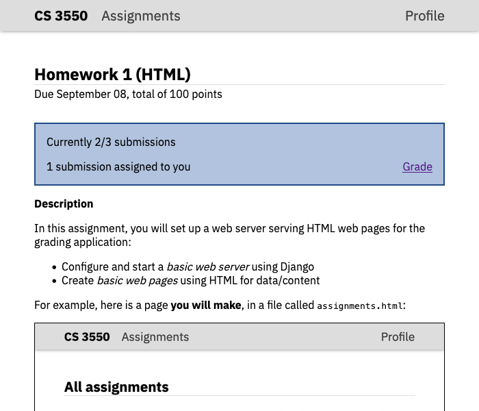
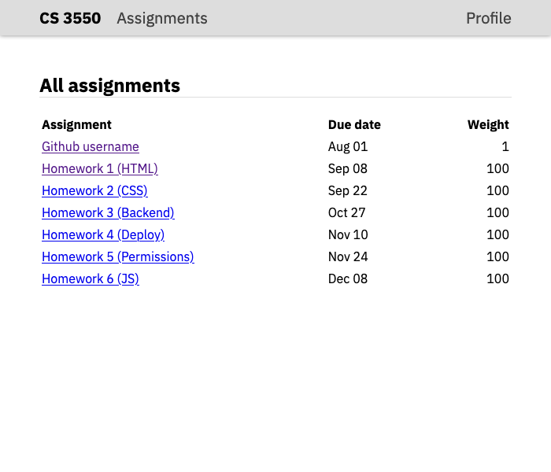
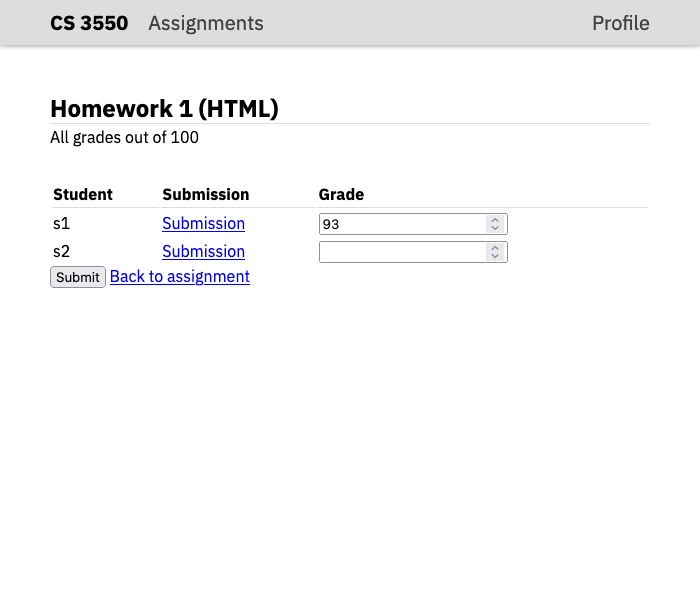
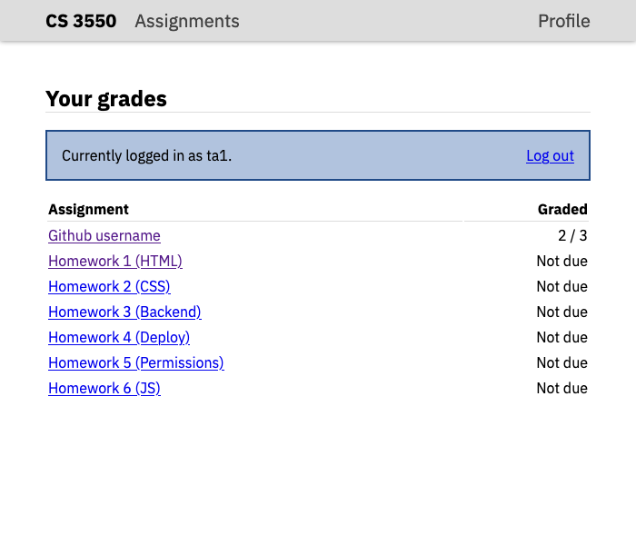
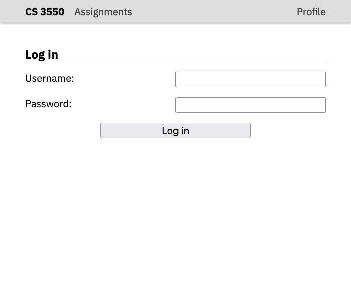

CS 3550 Assignment 1 (HTML)
===========================

**Status**: Final \
**Due**: Phase 1 due **1 Sep**. Phase 2--4 due **8 Sep**.

About
-----

In this assignment, you will set up a web server serving HTML web
pages for the grading application. We will build upon this HTML code,
and this web server, in later assignments. Specifically, in this
assignment, you will demonstrate that you can:

- Configure and start a basic web server using Django
- Create basic web pages using HTML for data/content and CSS for style
  and placement
- Understand many common HTML structural, textual, and media elements
- Understand common HTML element attributes for those elements

The assignment is due Friday, 8 September before midnight. The course's
normal extension policy applies. Hand in your finished assignment by
pushing it to your repository on Github

This assignment is intended take 6--8 hours and must be done solo. If
you've been working on it for longer than that and feel stuck, go get
help on Discord or sign up for an office hours slot.

All code you turn in must be yours. This includes copying code from
sources on the internet, *including the source code of live websites*
or code generated by AI tools. You may discuss, plan, and confer with
your peers about the broad strokes of how to do this assignment, or
ask their help debugging your code. However, any peers you do confer
with must be listed on the assignment cover sheet.

Phase 1: Starting the web server
--------------------------------

First, [install all of the required software](install.md) and make
sure all the indicated commands work.

Second, check out your Github repository and rename the folder to
`cs3550`. You will do all of your coding for this class inside this
folder.

Third, run the following set of commands:

    cd <path>/cs3550
    python3 -m django startproject cs3550 .

In the first command, replace `<path>` with whatever path is necessary
to get to the Git checkout. The second command creates a Django
"project" called `cs3550` and puts it in the current directory.

Test that this worked by running:

    python3 manage.py runserver

This should print some messages, ending with the line "Quit the server
with CONTROL-C". Open your browser and go to http://localhost:8000/;
you should see a page informing you that "The install worked
successfully! Congratulations!" You can now press `Ctrl+C` in the
terminal to stop the server.

*MacOS users*: In some cases, depending on where you've put these
files, you may see errors from "Watchman". Usually this means you need
to press "yes" some some permissions dialogs that have popped up, but
if the error persists, you can add `--noreload` to the `runserver`
command. This disables Watchman, but the cost is that you may need to
terminate and restart the server process every time you change your
application.

If at any point in these steps you get what looks like an error
message, get help.

Fifth, edit the file `cs3550/settings.py` inside your repository. Find
the line that starts with `STATIC_URL` and add the following line
below it:

    STATICFILES_DIRS = [ 'static/' ]

Create a directory called `static` inside your repository. Your
repository should now contain the following files and folders:

- A folder `cs3550`, which in turn contains `settings.py`, `urls.py`,
  `wsgi.py`, `asgi.py`, and `__init__.py`. It might also contain a
  `__pycache__` directory, which is auto-generated by Python.
- A file `manage.py`, which you use ran above
- An empty folder `static`
- Possibly a file called `db.sqlite3`, which your application manages

Sixth, create the file `.gitignore` in the root of your repository.
Add the following contents:

    uploads/*
    db.sqlite3
    *.pyc
    .DS_Store
    autotester

This makes sure you don't commit any autogenerated files to Github.

Seventh, create a file `test.html` in the `static` directory. Add the
following contents:

    <!doctype html>
    The test worked.

Test that this all worked by running:

    python3 manage.py runserver --noreload

Open your browser and go to http://localhost:8000/static/test.html

You should see the words "The test worked." on your screen. If you do,
commit everything to Github; Phase 1 is done. If you do not, get help.


Phase 2: Writing the assignments page
-------------------------------------

Create the file `index.html` in the `static` directory. In this file,
you can write HTML code, and the web page defined by that HTML code
will show up when you start the server (by executing the `runserver`
command) and go to http://localhost:8000/static/index.html in your
browser. Your task is add HTML code to this file to make an
"assignment" page for the grading application, which is intended to
look like so:



As you can see, there is a navigation bar, a header, basic data about
the assignment, an "action block" with details about grading, and a
description of the assignment, which itself contains styled text, a
bulleted list, and an image.

Because you are currently writing unstyled, basic HTML your web page
will look very different---for now. Without adding CSS code to style
your HTML, it will look quite plain. However, choosing the correct,
semantic HTML tags is essential for making the page stylable later on.

Additionally, keep in mind that the page:

- Must be valid HTML5
- Must contain the `<meta charset="utf-8">` tag.
- Must set the tab name to "Assignment 1 (HTML) - CS 3550" and set the
  tab icon to the [application icon](resources/favicon.ico).
- Must contain exactly the same text and images
  
You can find a copy of the [favicon file](resources/favicon.ico) in
the `resources` directory of this repository. It looks terrible but
that isn't the point. You can find a copy of the
[image](screenshots/assignments.png) in the `screenshots` directory of
this repository.

Use appropriate structural elements, including `<header>`, `<nav>`,
and `<main>` for the main areas of the page; `<em>`, `<strong>`, and
`<code>` for inline text markup; `<h1>`, `<h2>`, `<ul>`, `<li>`, and
`<p>` tags for text structure; and `<a>` and `` tags for links
and images. Include all required attributes, such as `href` for `<a>`
tags and `src` for `` tags.

In the header, make "Assignments" link to `assignments.html` and
"Profile" link to `profile.html`. (This way the links will all work
when you add more pages later.)
  
As you work on this web page, make sure to write valid, well-indented,
and easy-to-read HTML code. If you make mistakes, be sure to use the
browser developer tools to understand how your browser is interpreting
your HTML code and why it looks the way it does.

You do *not* need to explicitly write the `<html>`, `<head>`, or
`<body>` element, or write closing tags if they are optional. Nor do
you need the closing slash on void elements like ``.

Phase 3: Creating more pages
----------------------------

Let's now turn to the `assignments.html`, `submissions.html`,
`profile.html`, and `login.html` pages. Specifically, you'll make each
of these pages as if a TA is logged in to the grades application.
Later on in the class, you'll add support for both students and TAs
and different users will then see different content.

Here are what these four pages should look like:

|                                                       |                                                       |
|-------------------------------------------------------|-------------------------------------------------------|
|  |  |
|          |              |

Write HTML for each view. Make sure that:

- Each page should use the same HTML for the header portion
- Each page should set an appropriate tab title and set the tab icon
- Each table must use proper HTML for tables, including `<table>`,
  `<tr>`, and `<td>` elements.
- When necessary, tables should use `<thead>`, `<tfoot>`, and `<th>`
  elements to mark header and footer rows.
- Input elements should use `<label>`, `<input>`, and `<button>`. Make
  sure to pick the right `type` for each `<input>` element and the
  right `for` for each `<label>` element.
- Make sure all links work. You should be able to click any link and
  go to another of the pages you have created.

As in Phase 2, make sure to write valid, well-indented, and
easy-to-read HTML code. Make use of the browser developer tools or an
HTML validator to understand and correct problems.

Phase 4: Improving accessibility
--------------------------------

Let's now make a variety of tweaks to the pages you've developed to
make them more accessible.

First, let's make the page easier to use from the keyboard. Go to the
"login" page and press the `Tab` key on your computer. This will move
you from one thing on the page to another. Make sure doing this goes
through the fields in the order username, password, login button.

Also, pretty much any time anyone shows up on this page, they'll be
using the form, so use the `autofocus` attribute to make it so the
user can immediately type into the username box when they load the
page.

Second, let's make sure any content on the page has textual
descriptions. Screen-readers can read these descriptions to blind
users.

Add an `alt` attribute to the assignment image. Make sure to describe
the useful contents of that image. Make sure every input element has a
`<label>` associated with it. On the `submissions.html` page, there's
no room for a label; in this case, add a `title` to the `<input>`
element. Make sure the title contains all the information someone
would need to know what to type into the input element.

Third, let's make sure links have useful content.

Look over all of the links and buttons on all of the pages. Most links
will be described by the linked text (like the navigation links at the
top of the page) but some aren't. Add `title` attributes to those
links with fuller descriptions. Make sure the title contains all the
information someone would need to know what is at the link.

Finally, is the "Back to assignment" link on the `submissions.html`
page more of a link or a button? (A link goes somewhere, a button does
something.) I think of it as more like a button, because it cancels
any edits the TA may have made to the grades; give it the `button`
role. Likewise, give the `button` role to the "Log out" button on the
`profile.html` page.

Write a cover sheet
-------------------

Rerun `python3 manage.py runserver` and confirm that every page looks
as expected. Also confirm that all of the links work and that all of
the HTML source code is readable.

If you find any problems, use the browser developer tools or an HTML
validator to understand and correct the problem.

Once you are sure everything works correctly, copy-and-paste the
following text into a new empty text file called "HW1.md":

```
Homework 1 Cover Sheet
----------------------

In this assignment, I completed:

- [ ] Phase 1
- [ ] Phase 2
- [ ] Phase 3
- [ ] Phase 4

I discussed this assignment with:

- ...
- ...
- ...

[ ] I solemly swear that I wrote every line of code submitted as part
of this assignment (except that auto-generated by Django).

The most interesting thing I learned in this assignment was ...

The hardest thing in this assignment was ...
```

In the first list, replace `[ ]` with `[x]` for each phase of the
assignment you completed.

In the second list, replace the `...`s with the names of all other
persons (student, friend, family, online stranger) that you discussed
this assignment with.

In the oath below that, check the box. Recall that, while you may
discuss the assignment in broad strokes, you must write every line of
code submitted by you, as stated in the oath below this list. This
includes the use of AI tools such as ChatGPT.

In the last two paragraphs, replace the `...` with the most
interesting and the most difficult aspect of this assignment. Don't
just make them a single sentence; the instructors use your answers to
make these assignments more interesting and easier.

How you will use this
---------------------

Every real-world web page has HTML just like what you wrote. Writing
appropriate, semantic HTML is important because it helps with styling,
search engine results, and accessibility.

We'll also shortly write CSS code that adjust how each HTML element
looks so that your HTML looks like the screenshots you were working
off of.

Additionally, in a real-world website, much of the HTML is generated
programmatically based on data in a databse. For example, the rows in
the table of assignments would be generated by a `for` loop, where
each iteration of the loop generates one row. You will write this kind
of programmatic HTML generation in HW3.

Finally, accessibility is important to almost all real-world websites.
Not only do disabilities affect a substantial fraction of the
population (instead of thinking about your friends, think about your
older family members), but accessibility techniques also help
non-disabled users as well. For example, if you set up your `<label>`
elements correctly, clicking on a label should allow you to type into
the associated input field.

Grading Rubric
--------------

This assignment is worth 100 points. The different phases are worth
different weights:

**Phase 1** is worth 10 points. It is graded on:

- Your repository must contain a Django project named `cs3550`
- Your web server must start and respond to requests on `localhost`
- Your web server must successfully show the test page at
  http://localhost:8000/static/test.html
  
If you pass all auto-tests up to and including "Checking that
`/static/test.html` exists", then you have completed this phase.

Note that if you don't complete this phase, it is impossible to grade
most of the others, so you won't receive a passing grade.

**Phase 2** is worth 25 points. It is graded on:

- All of the required content must be present.
- The appropriate structural HTML elements must be used for the
  various parts of the page.
- The appropriate textual elements must be used for all of the
  formatted text.
- The appropriate HTML attributes must be used where required.

**Phase 3** is worth 50 points. Is is graded on:

- All of the required views must exist.
- Each view must contain all of the required content.
- Each view must use appropriate HTML elements.
- Each view must set the appropriate HTML attributes where required.
- All links on each view must work and go to the appropriate other view.

**Phase 4** is worth 10 points. It is graded on:

- Tab order and autofocus must be set correctly
- All images, links, and input elements must have appropriate
  descriptions
- The `button` role must be set for the "Back to assignment" and "Log
  out" links.

**Cover Sheet** is worth 5 points. It is graded on:

- Cover sheet is formatted correctly.
- All questions on the cover sheet have coherent answers.

Note that if your cover sheet does not list all people you discussed
the assignment with, or misrepresents others' work as your own, that
is academic misconduct and can result in severe sanctions beyond the 5
points the cover sheet is worth. In the most severe cases, the
sanction for academic misconduct is failing this course.
