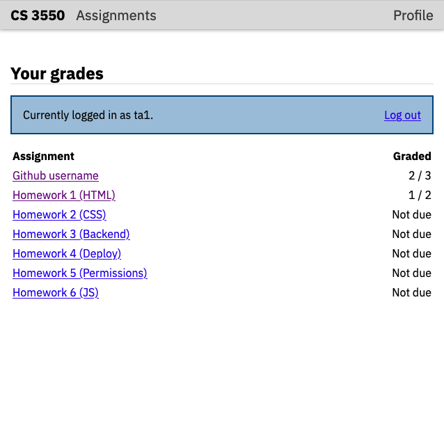
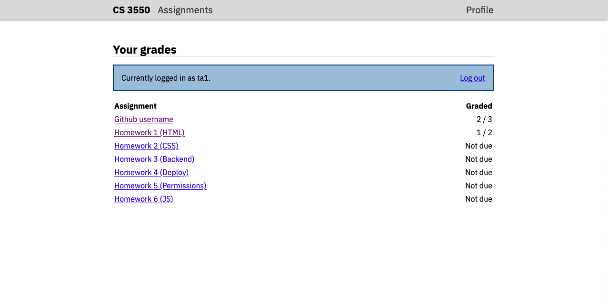

CS 3550 Assignment 2 (CSS)
==========================

**Status**: Draft (to be finalized by 8 Sep) \
**Due**: Phase 1 due **15 Sep**, Phase 2--6 due **22 Sep**

About
-----

In this assignment you'll write a CSS file to style the HTML pages you
wrote for [Homework 1](hw1.md). Your pages will then exactly match the
typography, appearance, and layout of elements in the screenshots
provided. You will thereby demonstrate that you can:

- Write valid CSS code and serve it from a web server
- Modify HTML code to make it accessible from CSS selectors
- Convert visual designs into web page stylesheets
- Build moderately complex layouts using flex-box

The assignment is due Friday, 22 Sep before midnight. The course's
normal extension policy applies. Hand in your finished assignment by
pushing it to your repository on Github.

Phase 1: Serving a CSS file
---------------------------

Create a file named `main.css` in your `static/` directory. Add the
following contents:

    * { color: red; }

This CSS makes (almost) all text on the page red. Start your server
and test that http://localhost:8000/static/main.css shows exactly this
contents.

Edit your `index.html` file and add a `<link>` element. Its
hyperreference should point to `/static/main.css`, and the
relationship type should be `stylesheet`. Open your `index.html` page.
Make sure that the text is red. If not, seek help.

Now edit the CSS file to replace `red` with `yellow`, and refresh the
`index.html` page in your browser. The text is likely *still red*, not
yellow. (If it's already yellow, that's OK too.) This is due to
*caching*: your browser remembers the CSS from before and is saving
time by not re-requesting it. If you open up the `main.css` file
directly and refresh, you'll see it now say `yellow`, and if you then
refresh the `index.html` file it will now have yellow text. Be careful
of this as you do this assignment!

Go through the other four HTML files and add the same `<link>` element
to all of them. If all five total pages now have yellow text, commit
everything to Github. You should see the Github Action turn green. If
so, Phase 1 is done. If you do not, get help.

General rules
-------------

You can remove the yellow-text line from your CSS now. (You will
continue to pass Phase 1.)

When writing any CSS for the phases below, stick to the following
rules:

- All lengths should use `rem` units, except borders and shadows,
  which should use `px`
- Always use unitless multipliers for `line-height`
- Do not use any `display` mode except the default and `flex`
- Do not use tables for layout
- Do not use any colors besides `black`, `#444`, `gray`, `#ddd`, and
  `white`, plus `#204a87` and `#b1c3de`
- Include external fonts using `@import` instead of `<link>` elements.
- Never use `style` attributes on HTML elements or `<style>` elements.
- All five HTML pages should share the same CSS file. Where page
  elements are repeated, the same CSS rule should apply on each page.
- Minimize your use of the `class` and `id` attributes. Prefer
  selecting things based on tag names and containment.
- Do not use negative `margin` values or the `float` or `position`
  properties.

You may need to modify your HTML, but you must keep your HTML valid
and semantically-meaningful. Limit the number of `class` and `id`
attributes and `div` and `span` elements that you use.

Try to organize your CSS file so that each Phase below is clearly
separated in the file. If possible, add a comment indicating which CSS
rules are for which Phase. This helps the TAs grade your assignment.

It's helpful to have names for the various parts of the page. Pages
contain:

- A gray *navigation banner* at the top of each page. The text inside
  it ("CS 3550", "Assignments", and "Profile") is called the contents
  of the navigation banner.
- The rest of the page is called the *main contents*
- At the top of the main content is a *page title* and *subtitle*. The
  title is text like "Homework 1 (HTML)" or "Your grades", and the
  subtitle is the smaller text below that like "Due September 08" or
  "All grades out of 100". All pages have a page title, but not all of
  them have a subtitle.
- Two pages have blue boxes with text and links inside. These are
  called *action blocks*
- Pages that have tables always have a *header row* at the top

Phase 2: Typography
-------------------

Start by styling the text. All text on the page should use the [IBM
Plex Sans][ibm-plex-sans] font, except for code, which should use [IBM
Plex Mono][ibm-plex-mono]. You will need to include three styles for
the Sans font (regular, regular italic, and bold) and one style for
the Mono font (regular). We don't have any bold italic text or any
other weights, so don't include any others.

Include both font on your page using Google Fonts. Use the `@import`
method instead of the `<link>` method. Do not create a separate
`<style>` element in your HTML. Instead, note that the `<style>`
element suggested by Google Fonts has a single long `@import` line.
Copy that `@import` line into your `main.css` file.

*Note:* This `@import` method is less efficient than adding the
`<link>`, so you wouldn't want to do it in a production website. It
forces the browser to download your CSS file before it can start to
download fonts, whereas with `<link>` it can start both in parallel.
However, `@import` is much simpler for us to grade, and the speed
impact isn't large, so `@import` is required for this assignment.

[ibm-plex-sans]: https://fonts.google.com/specimen/IBM+Plex+Sans
[ibm-plex-mono]: https://fonts.google.com/specimen/IBM+Plex+Mono

Add a rule to set all text on the page to use IBM Plex Sans. Add a
rule to make source code (like the text `assignments.html`, included
in the page `index.html`) use IBM Plex Mono. Make sure to add a
"fall-back" to a system font using the CSS keyword fonts.

Set the `line-height` to 1.25× for all text on the page. However,
inside tables, it is helpful to have a larger spacing between rows,
because inside tables there are large gaps that make it harder to know
which entry goes in which row. Set the `line-height` to 1.5× inside
tables.

In the page navigation banner (the part that contains the text CS 3550
and the links to "Assignments" and "Profile"), set all text to the
same size, which is 25% larger than the default font size. Set the
links in the navigation banner to be dark gray. Make the text "CS
3550" bold, while leaving all of the other links not bold.

In the page title (the part that changes for different pages), set the
title to be 50% larger than the default font size.

Set the "Description" header in `index.html` to be the default font
size.

Set all text inside the login form to be 25% larger than the default
font size. This includes the "Username:" and "Password:" labels; the
"Log in" label inside the button; and any text the user types into the
username and password fields.

Phase 3: Borders, backgrounds, and whitespace
---------------------------------------------

Remove any `margin`s or `padding` on the `html` and `body` element.
This way, the very first element on the page (the navigation banner)
touches the top, left, and right of the browser window.

Give the navigation banner at the top of the page a gray background.
Make the main "CS 3550" text black and bold, but the other links
should be slightly lighter and have regular weight. Give the
navigation banner a gray shadow. It should have no offset in either
the *x* or *y* directions and have a 5 pixel blur radius.

Two of the pages (`index.html` and `profile.html`) have action cards.
Set their border, background, and padding to match the screenshots.

Make sure there are `3rem` of whitespace between the page title and
the navigation banner.

Make sure there is `1rem` of whitespace between most other elements on
in the main content, including: after the page title/subtitle; around
action cards; in `index.html`, before and after the "Description"
heading; between paragraphs and list items; and before and after
tables and figures.

Add a light gray horizontal line below the page title. It should go
*between* the page title and subtitle. There should not be any extra
whitespace before or after these horizontal line. Do not use an `<hr>`
element; instead, use `border-bottom`.

Phase 4: Styling Links, Forms, and Tables
-----------------------------------------

Make it so that when you hover over a link in the navigation banner,
but not when you're not hovering over it, the link has an underline.
This hints to people that the link is clickable. Make it so that when
the link is "active", that is, *while* you are clicking on it, it is
black. This seems minor but helps the user know they are taking an
action when they click.

Ensure that all tables span the whole width of the main content.

Make table columns that contain numbers right-aligned. These include
the "weight" column in `assignments.html` and the "graded" column in
`profile.html`. You will need to add the same `class` to each cell in
that column. (This is tedious now, but once we generate some of this
HTML with templates, some of the code duplication will go away.) The
header for that column should also be right-aligned.

Now consider two pages that contain forms: the `submissions.html` page
and the `login.html` page.

In `login.html`, the login form should contain three rows (for the
username, password, and button) with a gap of `1rem` between rows.
Both text entries and the submission button should be half as wide as
the main content. The text entries should be aligned to the right edge
of the main content, while the button should be centered. You may need
to add more HTML elements wrapping each label and text entry to
accomplish this.

In `submissions.html`, leave the text entries in the "grade" column
and the "Submit" button at their default widths.

Make sure the "Submit" and "Back to assignment" links are horizontally
adjance to each other. There should be a gap of `1rem` between them.

Phase 5: Layout
---------------

Ensure that the navigation banner has all of its contents in a
horizontal row. The text "CS 3550" and the "Assignments" link should
be on the left, while the "Profile" link should be on the right. There
should always be a gap of `1rem` between any two of those links.

At the moment, both the navigation bar and the main content are as
wide as the browser window. This makes the page hard to use on big
screens. We want to make sure that:

- Neither the content of the navigation banner nor the main content
  should ever be more than `50rem` wide.
- There should always be at least `1rem` between the edge of the
  browser window and the edge of the navigation banner content or the
  main content.
- There should never be a horizontal scroll bar on narrow screens.
  This means that on narrow screens, the navigation banner and main
  content should be narrower than `50rem`.
- The gray background of the navigation banner and its shadow should
  always span the whole width of the browser window.
  
You can see how the browser width affects the page in the screenshots
below:

|                                                                                |                                              |                                                                            |
|--------------------------------------------------------------------------------|----------------------------------------------|----------------------------------------------------------------------------|
|  |  |  |

This effect is tricky to replicate. You will need to use `width`,
`padding`, and the `calc` and `max` operators. Make sure to test it at
various widths. Make sure that the navigation banner and main content
behaves correctly in all five HTML pages.

Also make sure that the link inside each action card is at the right
end of the card, at any page width.

Write a cover sheet
-------------------

Run your server and view each page on your website in your browser.
Make sure that each page looks as close as possible to the screenshots
above. Read through the requirements of Phases 1--5 and ensure that
all requirements are met. Moreover, make sure that your website HTML
still passes all the requirements of [Assignment 1](../hw1/index.md)
despite any changes you may have made.

If you find any problems, use the browser developer tools to
understand and correct the problem.

Once you are sure everything works correctly, copy-and-paste the
following text into a new empty text file called "HW2.md":

```
Homework 2 Cover Sheet
----------------------

In this assignment, I completed:

- [ ] Phase 1
- [ ] Phase 2
- [ ] Phase 3
- [ ] Phase 4
- [ ] Phase 5

I discussed this assignment with:

- ...
- ...
- ...

I solemly swear that I wrote every line of code submitted as part
of this assignment (except that auto-generated by Django).

The most interesting thing I learned in this assignment was ...

The hardest thing in this assignment was ...
```

In the first list, replace `[ ]` with `[x]` for each phase of the
assignment you completed.

In the second list, replace the `...`s with the name of your partner
as well as any other person (student, friend, family, online stranger)
that you discussed this assignment with.

In the oath below that, check the box. Recall that, while you may
discuss the assignment in broad strokes, you must write every line of
code submitted by you, as stated in the oath below this list. This
includes the use of AI tools such as ChatGPT.

In the last two paragraphs, replace the `...` with the most
interesting and the most difficult aspect of this assignment. Don't
just make them a single sentence; the instructors use your answers to
make these assignments more interesting and easier.

How you will use this
---------------------

Real-world websites use CSS to change how they look; writing CSS is
part of just about any website. The specific stylistic features you
worked on---such as headers, navigation bars, text, forms, and tables,
are common elements of most websites, so styling them is a common
activity, and in this assignment you've implemented a relatively
common design.

Of course, real-world websites tend to have more pages, necessitating
more HTML, and may have more complex layouts including overlapping
elements, pop-up menus, and so on. These are also implemented with
CSS, and the CSS skills you've developed here are a foundation you can
build on to acheive more complex layouts.

Also, in a real-world website, before writing the CSS, you'd first
design what you actually want the page to look like. Here, the design
is given to you directly, so you're not doing that part, but we did
discuss the basics of design in class.

Grading Rubrik
--------------

This assignment is worth 100 points. The different phases are worth
different weights:

**Phase 1** is worth 5 points. It is graded on:

- Your web server must serve a CSS file at
  http://localhost:8000/static/main.css
- You must not have any other CSS files, `style` attributes, or
  `<style>` elements.
- All five HTML pages created in [Homework 1](hw1.md) must link to
  that CSS file.
  
If you pass all auto-tests, then you have completed this phase.

**Phase 2** is worth 20 points. It is graded on:

- Pages must use IBM Plex Sans for all text except code, and IBM Plex
  Mono for all code
- Line heights must be set appropriately for both text and tables
- Font sizes, weights, and colors must be set appropriately for each
  element

**Phase 3** is worth 25 points. It is graded on:

- The navigation banner must have the required background and shadow
- Action cards must have the appropriate background, border, and
  padding
- Margins and paddings must be set on all elements as required.
- There must be a light gray horizontal line between the page title
  and subtitle, or after the page title, on each page

**Phase 4** is worth 20 points. It is graded on:

- Hovering and clicking links in the navigation banner should change
  underlining and color as required
- Tables should span the whole width of the main content, and columns
  must be aligned appropriately.
- The login form must be laid out with the required widths and gaps.
- On the submissions page the form elements and links must have the
  required widths, layout, and gaps.

**Phase 5** is worth 25 points. It is graded on:

- The main content must have the required width on both narrow and
  wide viewports.
- The navigation banner must stretch the whole width of the viewport,
  and its content must have the required width on both narrow and wide
  viewports.
- Both main content and navigation banner must have the required
  gap from the edge of the viewport.
- Links insider action ccards must be at the right edge of the action
  card.

**Cover Sheet** is worth 5 points. It is graded on:

- Cover sheet is formatted correctly.
- All questions on the cover sheet have coherent answers.

Note that if your cover sheet does not list all people you discussed
the assignment with, or misrepresents others' work as your own, that
is academic misconduct and can result in severe sanctions beyond the 5
points the cover sheet is worth. In the most severe cases, the
sanction for academic misconduct is failing this course.
