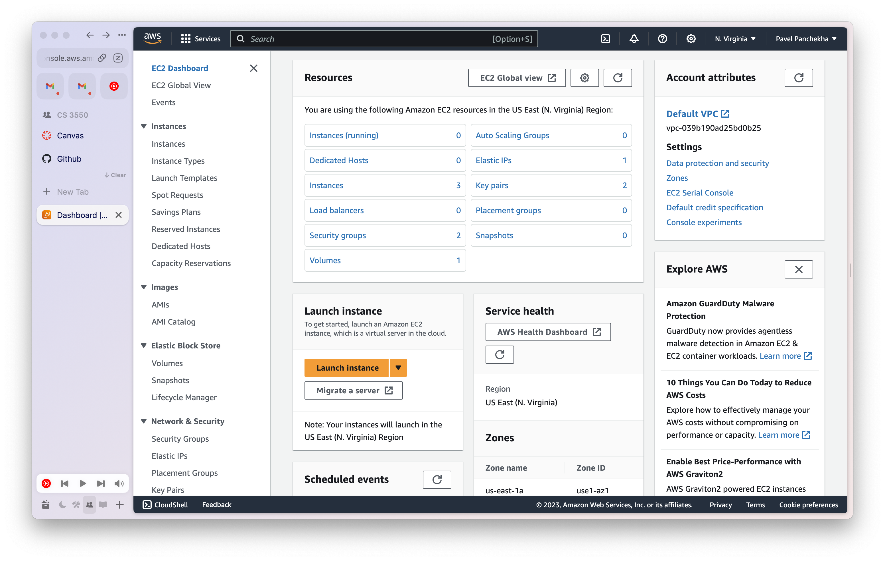
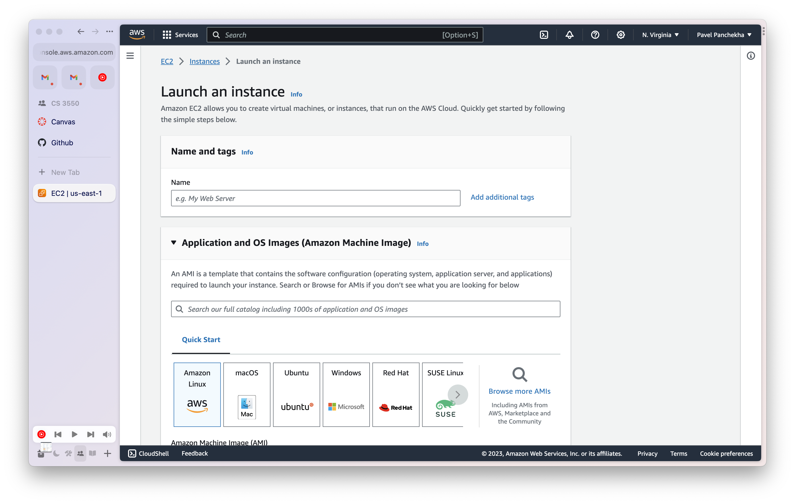
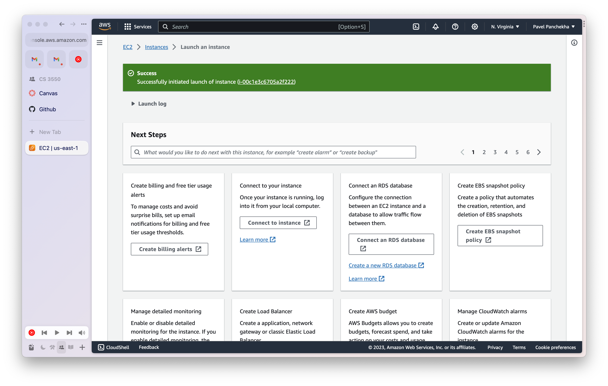
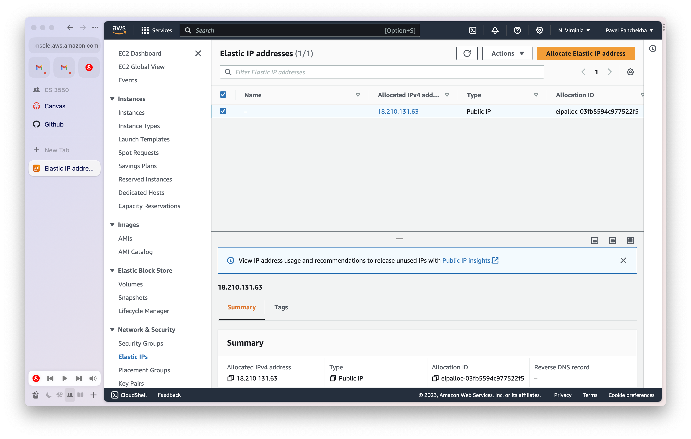
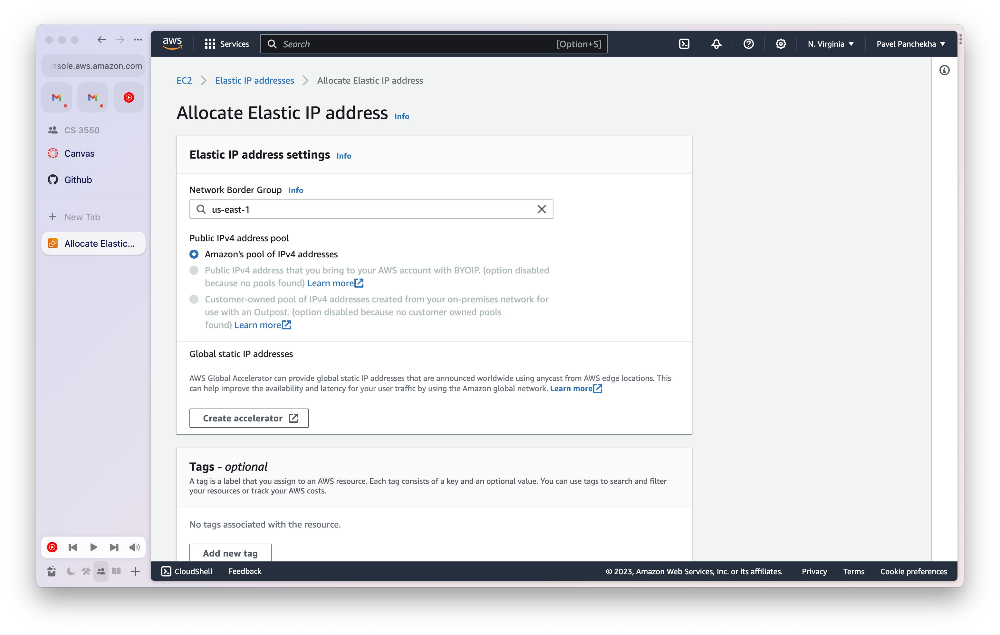
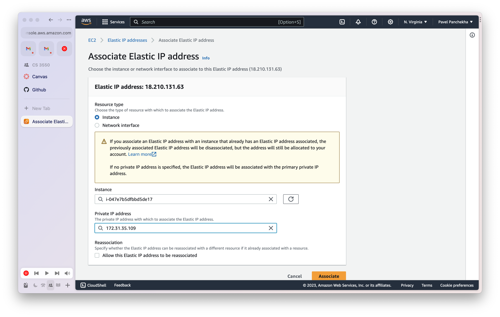
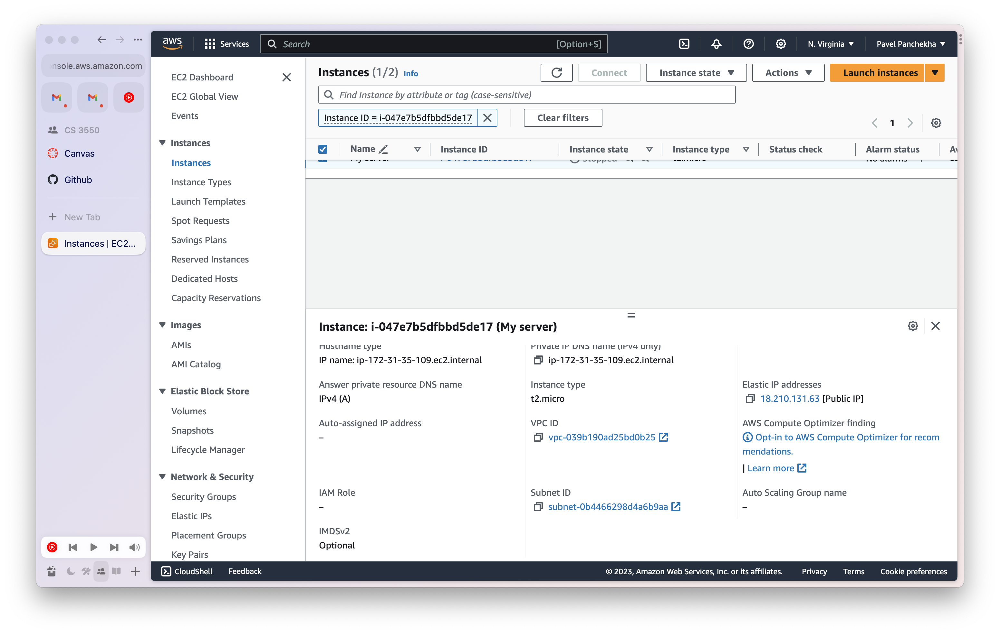
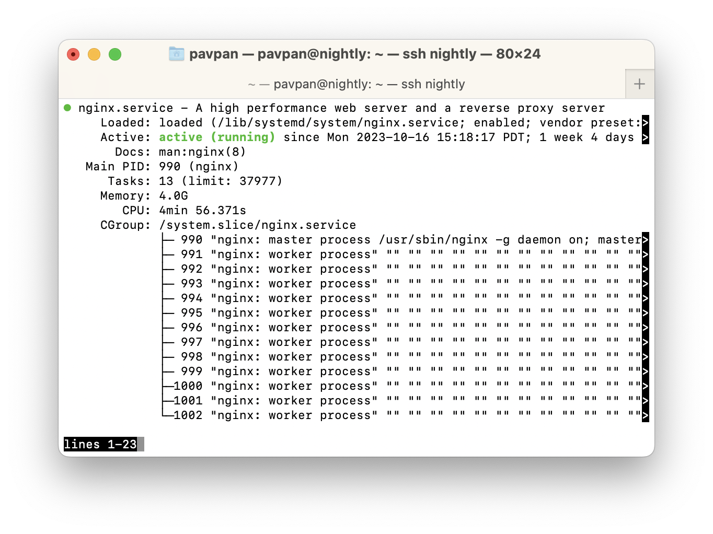

CS 3550 Assignment 3 (Django)
==========================

**Status**: Final \
**Due**: Phase 1 due **3 Nov**, Phase 2--5 due **10 Nov**

About
-----

In this assignment you'll deploy your grading application using AWS
EC2. The grading application will then become publically accessible.
Specifically, you will:

- Purchase a domain
- Rent a virtual computer from Amazon Web Services
- Install Django and a web server to that virtual machine
- Set up that machine to serve your website
- Acquire LetsEncrypt certificates for your website

The assignment is due Friday, 10 Nov before midnight. The course's
normal extension policy applies. See below for hand-in instructions;
they are different from normal assignments

General Rules
-------------

By and large, this assignment involves carefully following directions
without much creativity. As a result, please feel free to ask for help
and include screenshots, error messages, or the like; it won't count
as plagiarism unless it's literally someone else clicking the buttons.

Likewise, feel free to use online resources. There are *many* online
guides to setting up EC2 machines, NGINX, and similar, and many have
detailed screenshots that might help you. That said, be aware that
EC2, NGINX, and all the other services change over time and old guides
you find online might not exactly correspond to what you see.

Do not move on to a later phase until all of the earlier ones are
done. If you're having trouble with some phase, seek help, including
on Discord, at Office Hours, or after class.

Both AWS and Linux are pretty complicated. The instructions included
in this assignment, if followed carefully, should allow you to
successfully deploy your application, but if you aren't careful it's
possible to make pretty complicated mistakes. It's not a bad idea to
try to fix things, but sometimes the easiest way to get something
working is to delete the instance and start over, this time following
the instructions more carefully.

In these instructions we'll be using tools like SSH and SCP to connect
to your remote machine. These tools are available by default on macOS,
Linux, and the Windows Subsystem for Linux, and it's recommended that
you use one of these platforms.

That said, if you'd like to use Windows but you don't want to use
Windows Subsystem for Linux, you can download a suite of programs
called PuTTY from [putty.org](https://putty.org). PuTTY implements SSH
and SCP as a native Windows application, and can be used instead of
SSH and SCP in this assignment. Google searches like "Windows PuTTY
connect to AWS EC2 machine" will route you to many guides with
screenshots.

Phase 1: Purchasing a domain
----------------------------

The first step is to purchase a domain for your website. These cost
real money, though the price depends on the domain. Typically more
popular top-level domains like `.com` and `.ai` cost more, as do short
domain names. So you probably want to go with a longer domain on a
less-popular top-level domain if you want to find a good deal. You
should be able to purchase a domain you like for under $10, and it's
possible to find domains for under $5. Don't spend a huge amount on
this!

To purchase a domain, you must use a *registrar*. Popular registrars
that are well-regarded include [namecheap.com](https://namecheap.com),
[gandi.net](https://gandi.net), and [hover.com](https://hover.com).
Each of them allows you to search for a domain name, confirm that it
is available, and then purchase it.

It's worth checking multiple registrars because they sometimes have
deals or coupons. Also, if you sign up for the [Github for Education
pack](https://education.github.com/pack), you get a free `.me` domain
from Namecheap, which you can use if you'd like.

What you're purchasing is *one years'* registration for the domain. At
the end of the year, you either have to renew the registration
(for roughly the same price, usually, though they do go up over time)
or you lose the domain and someone else can purchase it.

Once you've purchased a domain, go to the registrar website and log
in. You now need to modify something called the "DNS records"
associated with this domain. How exactly you do this differs based on
the registrar. For example, in Namecheap, you would first select your
domain and then click on "Advanced DNS" to go to the DNS record page.
If in doubt, google the name of your registrar and "add DNS record".
Every registrar should have this capability; this is basically the
whole point of registering a domain.

Add a DNS record for your domain. A DNS record consists of four parts:

- A record type. You want `TXT`, meaning "text".
- A host. You want `@`, which means it applies to your domain as a
  whole, not to any subdomain.
- A value. This should be your Github username with no other
  punctuation.
- A "TTL", which is a length of time, in seconds, for which this
  record may be cached. You want 3600 (1 hour).
  
It takes time for the whole internet to learn about your new domain.
How long exactly depends on your ISP and physical location, but it
might take no more than a minute or two and typically will take no
more than a half hour. If you've waited a couple of hours and it still
doesn't work, you did something wrong.

Once you've added the DNS record, you can confirm that it worked by
looking up your domain on [nslookup.io](https://nslookup.io) or a
similar website. You should see your TXT record.
  
To complete this phase, create and commit a text file named
`DOMAIN.md` which contains just your domain name and nothing else,
like so:

    mydomain.tld

As long as that that domain has a TXT record containing your Github
username, you've passed this phase.


Phase 2: AWS and EC2
--------------------

In this phase you will rent a virtual computer from Amazon Web
Services (AWS), which you will then deploy your application to in
later steps.

# Create an AWS account

First of all, we need an AWS account.

Head over to [AWS](https://aws.amazon.com) and click the "Create an
AWS Account" button in the top right. You'll need to provide a "root
email account" and a username. The email and username don't have to
match an existing Amazon account, but it can if you want. Depending on
your existing Amazon account, some details of this phase will differ.

Next, you'll need to go through an email verification flow, where you
receive an email and click a link / copy a code from the email into
the AWS website. The email should come from `no-reply@signup.aws`.
Yes, AWS owns its own top-level domain.

Finish the account setup flow, which involves picking a password
and possibly signing up for two-factor authentication. Finally, log in
to the AWS console.

In the top-left corner, find the "Services" button and click it. In
the menu, select "Compute" and then "EC2". You should see something
that looks like this:




# Creating an instance

Next, we will ask AWS to create a virtual computer for us.

Click the "Launch instance" button. An *instance* is AWS's terminology
for a virtual computer in the cloud. You should see a screen like
this:



Give it a name and then, in the "Application and OS Image" section,
select "Ubuntu". Ubuntu is a popular variety of Linux.

In the "Instance type" section, select `t2.micro`. The type dictates
the CPU and memory your virtual computer will have; we are choosing
this specific instance type because it is more than sufficient for our
needs and also because it is eligible for the "free tier", which
allows roughly one total month of uptime, per year, for free.

In the "Key pair (login)" section, click the link labeled "Create new
key pair", give it a name, choose "RSA" for the key pair type. Choose
".pem" for the private key file format if you're on macOS or Linux or
using WSL, and choose ".ppk" if you're on Windows. Click "Create key
pair". Your browser will download a file. **Do not lose this file.**

In the "Network settings" section, click the checkboxes to allow HTTP
and HTTPS access. Leave the SSH checkbox checked.

Then, in the "Network settings" section, click the edit button in the
top-left corner. Next to "VPC" click the "reload" button and then
select "Create default VPC". Click through the resulting screen to
create a default "VPC". Once you see a green bar reading "You
successfully created vpc-xxxxxxxxxxx", head back to the EC2 page (it
should be in another tab), click the "reload" button next to VPC, and
now the VPC input box should be show some kind of default value. The
subnet input box should also now show "no preference", which is fine.
Under Auto-assign Public IP change the value to "Enable" if it wasn't
already "Enable".

Under "Configure storage" leave the default (8 GB of general-purpose
SSD storage) in place.

Do not modify anything under "Advanced details". Under "Summary"
ensure that the number of instances is 1.

Click "Launch instance". You should see a green banner saying
"Successfully launched instance i-xxxxxxxxxxxxx". Click on the ID
number. You should now be at a page that looks like this:



You should see a table in the top-right half of the screen, and there
should be one row in the table. That's your virtual computer. Under
"instance state" it should say "Running"; if it doesn't, wait a minute
or two and refresh the screen. (You're waiting for it to boot.)

Select your instance by checking that row of the table and then use
the "Instance state" dropdown to stop the instance. This turns off
your virtual computer. Refresh until the "instance state" says
"Stopped". Now select it again and use the same dropdown to start the
instance.

When you're not working on your assignment, stop the instance. When
it's running you are using up your 750 free hours and when those are
up AWS will want you to pay real money. The cost is roughly $9 per
month of uptime at the moment. (The costs typically stay the same over
time.)

# Assigning an IP address

Our virtual computer now exists, but it does not have a permanent IP
address. (Instead, a new one is assigned every time it restarts, which
is inconvenient and won't work for permanent web hosting.) We need to
allocate and assign a permanent IP address to our computer.

In the left-hand sidebar click "Elastic IPs" (under "Network &
Security"). You should see this screen:



Click the orange "Allocate Elastic IPs" button in the
top-right corner. You should see this screen:



Leave all settings at their default and click "Allocate" at the bottom
of this screen. You should see a green banner saying Elastic IP
address allocated successfully" and be looking at a new table with one
row in it.

Select the one row (it should already be selected) and click on the
Actions > Associate Elastic IP menu button. Leave the "Resource Type"
at its default value, "Instance", and then click into both the
"Instance" and "Private IP address" fields and select the one option
from the dropdown. It should look like this:



Then select "Associate" at the bottom.

In the left-hand sidebar, select "Instances" to get back to the
familiar table in the top-right. Select your one instance by checking
its box. In the bottom-half of the screen, check that there's now a
value under "Elastic IP", like this:



Add the Elastic IP to the `DOMAIN.md` file. It should be formatted
like this:

    mydomain.tld
    ip.ip.ip.ip

Commit and push to Github.

# Connecting to your machine

We're now going to connect to your virtual computer.

Write down your Elastic IP. We'll need it in a second.

Locate the "key pair" file you downloaded earlier. It should be called
"file.pem". Now run the following commands, assuming you are using
macOS, Linux, or WSL:

    cd directory/with/file.pem
    chmod 0700 file.pem
    ssh -i file.pem ubuntu@ip.ip.ip.ip

Substitute in the appropriate directory, file name, and Elastic IP
address. If you are using Windows but not WSL, you'll need to do
things slightly differently:

 - Make sure to download a PPK file, not a PEM file
 - Use PuTTY's UI to select an SSH connection
 - Put in the Elastic IP and select the PPK file as the key
 - When asked for a username, type in `ubuntu`

You should be able to connect to your virtual cloud computer; you'll
know you succeeded because you'll see a bunch of output and then a
command line that starts with `ubuntu@`. If you have succeeded, move
on to the next phase. Otherwise, seek help.

Phase 3: Installing essential software
--------------------------------------

In this phase, you'll be installing and configuring Python, Django,
and NGINX.

# Installing NGINX

First refresh the software installer:

    sudo apt update

Then install essential upgrades:

    sudo apt upgrade
    
If it asks you whether you want to continue, press Enter. This may
take a few minutes. This is important because there may be
security-essential fixes in the upgrades. If it asks you questions,
click through them using Tab and Enter, leaving everything at the
defaults.

Next install Python, the Python package manager PIP, the NGINX web
server, and the Certbot certificate manager plus its NGINX plugin:

    sudo apt install python3 python3-pip nginx certbot python3-certbot-nginx
    
Again, press Enter when asked whether to continue. If asked further
questions, click through them as before. This will also take a few
minutes.

Tell the NGINX server to run on startup:

    sudo systemctl enable nginx

Open your browser and navigate to that IP address, as in
http://XX.XX.XX.XX/ with your particular IP address in there. You
should see a default web page for the NGINX web server.

Start NGINX by running:

    sudo systemctl start nginx

Wait a few seconds and then run:

    sudo systemcl status nginx

You should see a bunch of output that starts with a green dot and
includes the green text "active (running)", like so:



If you don't see that, seek help.

Also run the following command:

    sudo systemctl enable nginx

This instructs NGINX to start automatically when the machine is
rebooted, which is convenient if you need to pause your work.

# Installing Django and configuring NGINX

Next, install Django:

    python3 -m pip install django

Run the following command to make sure this worked:

    python3 -m django version

Make sure it prints a version that starts with 4.2.

Now edit the NGINX configuration. To do so, run the following command:

    sudoedit /etc/nginx/sites-available/default

You are now using a text editor called Nano. You can type like normal
to add text to the file, and use the keyboard shortcuts shown on the
bottom of the screen to save the file, delete lines of text, and so
on. For example, the keyboard shortcut `^K` means you press `Ctrl+K`
to cut a line of text; you can paste it with `^U` meaning `Ctrl+U`.
You can exit Nano with `Ctrl+X`; it'll ask you whether you want to
save changes, and you can press ENTER to indicate that you do.

Edit the file until it contains the following text:

    server {
        listen 80 default_server;
        listen [::]:80 default_server;
        server_name your.domain.here;
        
        location / {
            proxy_pass http://localhost:8000/;
        }
    }
    
Make sure to put in your actual domain name. Also make sure to end
each line with a semicolon as appropriate. How you indent lines does
not matter but using TAB is standard.

This configuration tells the NGINX server to listen on port 80, both
in IPv4 and IPv6 mode, and to refer to itself as your domain. It then
asks NGINX to forward all requests to port 8000, where you will run
your server.

Restart NGINX by running:

    sudo systemctl restart nginx

Visit your web server again, by going to http://ip.ip.ip.ip/ but with
your server's Elastic IP address. You should now see a "504 Gateway
Timeout" error page. This actually means you've succeeded and can move
on to the next phase, because it means that NGINX is attempting to
contact your Django server (which isn't running yet).

However, if you continue to see NGINX's default web page, or you don't
see a web page at all, something has gone wrong. Make sure you've
restarted NGINX, and then run:

    sudo systemcl status nginx

You should again see a bunch of output that starts with a green dot
and includes the green text "active (running)". If you don't see that,
you probably made a typo in the server configuration; there `status`
command may have printed useful error information, or if you can't
figure it out, seek help.

You may wonder why we're running both Django's built-in server and
also NGINX. NGINX is much faster and more featureful and will handle a
lot of the complexities of web serving before passing requests on to
Django. This is a typical deployment strategy.

Phase 4: Deploy your server
---------------------------

Now we want to copy over our actual web application to your virtual
computer, so we can run it there.

# Copying over the files

You'll need to use something called "SCP". Open a **second terminal
window** and change directory to the folder that _contains_ your Git
repository. In other words, change to the directory that contains a
`cs3550` folder which in turn contains `cs3550`, `grades`, and
`manage.py`.

If your main directory is named after your username, instead of
`cs3550`, rename it now.

On macOS, Linux, and WSL, run:

    scp -r -i directory/to/file.pem cs3550 ubuntu@ip.ip.ip.ip:

Note the colon after the IP address! That's important! Also make sure
to put in the correct path to the PEM file containing your key and
also to put in the correct Elastic IP address.

On Windows, you'll instead need to run:

    pscp -i <key.ppk> cs3550 ubuntu@ip.ip.ip.ip:

If you get an error about `pscp` not being a valid command, check that
you installed PuTTY. If you're sure you did, find the PuTTY
installation in your "Program Files" or similar and then give the full
path to `pscp.exe` instead of just writing `pscp`.

Once you've successfully executed the command, you should see a lot of
output, one line per file that it's copying over. It can take a while
to complete. If you can't get this command to succeed, seek help.

# Running your application

Now switch back to the terminal that is logged in to your virtual
computer (or log in again in a new terminal). Run the following:

    ls cs3550

You should see all of the files in your project, in their usual files
and directories.

Now do the following:

    cd cs3550
    python3 manage.py runserver --noreload

Leave the terminal open and this command running. If you close the
terminal, or terminate the command by pressing `Ctrl+C`, you will shut
down your Django application, just like when you're debugging locally.

With the Django application running, open up a regular web browser and
visit http://ip.ip.ip.ip/ with, as usual, your Elastic IP. You should
see your application running and showing the list of assignments!

Make sure that the stylesheet, favicon, images, and links all work
correctly (except submission links, which need not work yet). If they
don't, check that you haven't hard-coded `localhost:8000` into any of
them. All links in your application should be to host-relative URLs
which start with a forward slash (`/`). If you find any broken URLs,
fix them. Then upload the new source code by re-running the `scp` (or
`pscp`) command and rerun the `runserver` command.

Phase 5: Setting up your domain with HTTPS
------------------------------------------

In this final phase, we set our application for permanent deployment.

# Run in production mode

Connect once again to your server and change to the `cs3550`
directory. Execute the following command:

    nano cs3550/settings.py

This once again starts up the Nano text editor, this time editing your
`settings.py` file. Find the line in the file reading `DEBUG = True`
and change it to read:

    DEBUG = False

Exit Nano (with `Ctrl+X`) and then run the following command:

    nohup python3 manage.py runserver --noreload
    
This starts your Django application once again, but it uses `nohup`
which means that if you close the terminal window Django will keep
running. If you want to stop it, you can run `killall nohup`.

While your server is running under `nohup`, close the terminal window
(without stopping the command), visit http://ip.ip.ip.ip/ and ensure
that your Django application is still running. Also make sure that you
are running in production (not debug) mode by visiting an invalid page
like `/12341234/submissions/`. This should show a bare-bones 404 page
instead of the usual Django debug 404 page.

# Set up your domain

Recall that in Phase 1, you purchased a domain name from a registrar.
Go to the registrar website, log in, and find the DNS record interface
once again. You now want to add the following DNS record:

- Record type: `A`, meaning "IPv4 Address".
- Host: `*` meaning all subdomains.
- Value: your Elastic IP address with with nothing else (no `http://`
  or any extra punctuation).
- TTL: 300, meaning 5 minutes.
  
Delete any other DNS records, except the TXT record you added in Phase
1, that may already be there. Some registrars add default DNS records
pointing to an "under construction" page.

Once you've added the DNS record and waiting the necessary length of
time, confirm that you can look up your domain on
[nslookup.io](https://nslookup.io) or a similar website and see your
Elastic IP address as an A record.

Check that you can now visit your domain in an ordinary web browser,
as long as you use `http://` and not `https://`.

# Setting up HTTPS

Now let's enable HTTPS as well. Run the following command:

    sudo certbot --nginx -d domain.tld -d www.domain.tld

Make sure to substitute in your own domain! You'll now need to enter
your email address (do so), agree to the terms of service (agree), and
choose whether or not to get emails from the Electronic Frontiers
Foundation, the non-profit that develops `certbot` (up to you).

After a bit of a wait you should see `certbot` report that it
succeeded. Run the following:

    sudo systemctl restart nginx

Check that you can now visit your domain using `https`.

Write a cover sheet
-------------------

When you are ready to submit, make sure your Django application is
running, even after you close you terminal window. The TAs will grade
your submission by accessing it from their browser. Make sure you can
view your website in an ordinary browser at the domain name you've
chosen. Also make sure that all of the stylesheets, images, favicons,
and links work (except the "submission" links on the submissions
page). Make sure both `http` and `https` work.

**Leave the instance and Django application running** while we grade
your assignment. Grading will take no more than a week, from 12
November to 19 November. You should have enough free tier time to
leave the instance running for the entire duration. **Once you've
received your grade, turn off the instance** to avoid being charged.

Once you are sure everything works correctly, copy-and-paste the
following text into a new empty text file called "HW4.md":

```
Homework 4 Cover Sheet
----------------------

In this assignment, I completed:

- [ ] Phase 1
- [ ] Phase 2
- [ ] Phase 3
- [ ] Phase 4
- [ ] Phase 5

[ ] I have checked that I did in fact update and push `DOMAIN.md`.

I discussed this assignment with:

- ...
- ...
- ...

[ ] I solemly swear that I wrote every line of code submitted as part
of this assignment (except that auto-generated by Django).

The most interesting thing I learned in this assignment was ...

The hardest thing in this assignment was ...
```

In the first list, replace `[ ]` with `[x]` for each phase of the
assignment you completed.

Below that, replace `[ ]` with `[x]` after checking that you did in
fact update and push `DOMAIN.md`

In the second list, replace the `...`s with the name of your partner
as well as any other person (student, friend, family, online stranger)
that you discussed this assignment with.

In the oath below that, check the box. Recall that, while you may
discuss the assignment in broad strokes, you must write every line of
code submitted by you, as stated in the oath below this list. This
includes the use of AI tools such as ChatGPT.

In the last two paragraphs, replace the `...` with the most
interesting and the most difficult aspect of this assignment. Don't
just make them a single sentence; the instructors use your answers to
make these assignments more interesting and easier.

Once you are done, commit everything and push it to Github. **Make
sure to include the text "Please grade" in your final commit message**
to help TAs identify the right commit to grade.

How you will use this
---------------------

AWS isn't the only cloud provider, but it's by far the largest, and is
a relatively common way to deploy web applications, including by
renting a virtual computer from the AWS EC2 service like you did. The
NGINX and Certbot tools are also industry standard tools that are part
of many web application deployments.

AWS provides a vast array of other services, with some of the most
commonly-used being S3, a cloud storage service; RDS, a cloud database
service; CloudFront, a content distribution service; Lamdba, a short
task compute service, and many others. Larger web applications would
make use of these services, both to improve performance and also to
reduce costs; some of them are covered in CS 4550.

Grading Rubrik
--------------

This assignment is worth 100 points. The different phases are worth
different weights:

**Phase 1** is worth 10 points. It is graded on:

- You must purchase a domain and name it in `DOMAIN.md`
- You must add a TXT record for that domain containing your Github username
- That record must be shown on DNS lookup tools such as [nslookup.io](https://nslookup.io)

**Phase 2** is worth 30 points. It is graded on:

- You must create an AWS account
- You must create an instance on EC2 using the `t2.micro` instance
  type and the Ubuntu OS image
- You must assign an Elastic IP to this instance and record the IP in `DOMAIN.md`
- You should be able to connect to your machine over SSH using the
  generated key pair.

**Phase 3** is worth 15 points. It is graded on:

- Your instance must be running NGINX on ports 80 and 443.
- NGINX must proxy all requests to `localhost:8000`.

**Phase 4** is worth 15 points. It is graded on:

- Your instance must run your web application
- All stylesheets, favicons, images, and links should work and point
  to other pages on the same server (except the "submission" links on
  the submissions page).

**Phase 5** is worth 25 points. It is graded on:

- Django is running in production (not debug) mode
- Your instance is accessible from the domain you purchased and
  recorded in `DOMAIN.md`
- Your instance is accessible over HTTPS.

**Cover Sheet** is worth 5 points. It is graded on:

- Cover sheet is formatted correctly.
- All questions on the cover sheet have coherent answers.

Note that if your cover sheet does not list all people you discussed
the assignment with, or misrepresents others' work as your own, that
is academic misconduct and can result in severe sanctions beyond the 5
points the cover sheet is worth. In the most severe cases, the
sanction for academic misconduct is failing this course.
