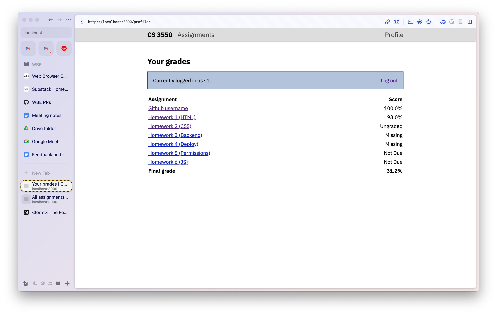

CS 3550 Assignment 5 (Permissions)
==================================

**Status**: Final \
**Due**: Phase 1 due **17 Nov**, Phase 2--5 due **24 Nov**

About
-----

In this assignment you'll add user authentication and authorization to
your application. You'll also fill out the student side of the
application. Specifically, you will:

- Set up a login system for users
- Customize what a user sees based on their identity
- Enforce a security policy for all existing views / actions
- Set up file uploads and secure them

The assignment is due Friday, 24 Nov before midnight. The course's
normal extension policy applies.

Phase 1: Enabling logins
------------------------

In your `views.py` file, add the following line to the top:

    from django.contrib.auth import authenticate, login, logout

Next, open up the `login.html` template. It should contain an HTML
form; make sure this form makes a `POST` request to `/profile/login`
and contains the mandatory `` block somewhere inside.
Also make sure that each `<input>` inside that form has a `name` and
the appropriate `type`.

Note that the form submits to the same URL that it is served from.
This is a common pattern, and it means the controller needs to use the
HTTP request type (`GET` or `POST`) to decide whether to render the
form or to process submissions.

So find your `login_form` controller. Currently, it merely renders
your `login.html` template. Modify the `login_form` controller so that
it continues doing that for `GET` requests, but add a separate branch
for `POST` requests. In that branch:

1. Extract the username and password from the POST request;
2. Then call [Django's `authenticate` function][docs-auth]
   (this function either returns a `User` object or `None`);
3. If authentication succeeds,
   call [Django's `login` function][docs-login]
   and then redirect to the `/profile/` page.
4. If authentication fails, re-render the form,
   same as if it were a `GET` request.

You are expected to follow the links above to learn how to call
`authenticate` and `login` correctly. Note that it is possible that
the `POST` request does not contain a username or a password. You can
handle this using Python's `get` method on hash tables:

    username = request.POST.get("username", "")

This returns the `username` value in `request.POST` if there is one,
or the empty string if there isn't.

In your `profile` view, pass `request.user` to the template. In the
`profile.html` template, in the action card, display the user's
`username` field. This step is important because it allows you to test
whether or not you actually logged in.

Test that you can log in and see the username you've logged in as on
the profile page. If you've run `makedata.py`, you can log in as:

- The admin user `pavpan`
- The TAs `ta1` and `ta2`
- The students `s1`, `s2`, and `s3`

Each user's password is the same as their username.

Next, define a `logout_form` controller. This controller should call
[Django's `logout` function][docs-logout] and redirect to
`/profile/login`. Modify `urls.py` so that `/profile/logout` routes to
this new `logout_form` controller. Modify the `profile.html` template
so that the "Log out" link takes the user to `/profile/logout`.

Test that logging out works correctly. When you are logged out, you
should either see no username or "AnonymousUser" on this page.

If you can log in, see your username on the profile page, and log out,
you should be done with this phase. You can confirm by using the
auto-tester. If the auto-tester passes, you are done with this phase.

[docs-auth]: https://docs.djangoproject.com/en/4.2/topics/auth/default/#django.contrib.auth.authenticate
[docs-login]: https://docs.djangoproject.com/en/4.2/topics/auth/default/#django.contrib.auth.login
[docs-logout]: https://docs.djangoproject.com/en/4.2/topics/auth/default/#django.contrib.auth.logout

Computing Grades
----------------

Since this is a grading application, we need to talk about how grades
are computed (at least in this series of homework assignments). It
should match what most actual professors do in your actual classes.

Basically, the grade for a student is computed by considering each
assignment in turn and looking at the student's submission for that
assignment. The student's submission could have one of four statuses:

- Submitted and graded
- Submitted but not yet graded
- Not submitted, because the assignment isn't due yet
- Missing, because the assignment is past due and there's no submission

A submitted and graded assignment has a score, which is written as a
percentage (the score on the submission divided by the maximum points
offered by that assignment). Missing assignments are treated as if the
score is a 0. Ungraded or not due assignments are ignored for the
purpose of grade calculation.

To put this more formally, you can compute a student's grade by
looping over assignments and tracking their available and earned grade
points:

- Graded assignments contribute their weight to available grade points
  and the grade percentage times the weight to earned grade points.
- Missing assignments contribute their weight to available grade
  points and nothing to earned grade points.
- Ungraded and not due assignments contribute nothing to either.

Here are some example assignments for a given student showing the
weight and points of each assignment, the status of the student's
submission for each assignment, their score (if graded), and the
contribution of that assignment to the student's available and earned
points.

| Assignment | Weight | Points | Status   | Score | Available | Earned |
|------------|--------|--------|----------|-------|-----------|--------|
| HW1        | 100    | 75     | Graded   | 70    | 100       | 93.33  |
| HW2        | 50     | 75     | Missing  |       | 50        | 0      |
| HW3        | 60     | 100    | Graded   | 73    | 60        | 43.8   |
| HW4        | 74     | 90     | Ungraded |       | 0         | 0      |
| HW5        | 100    | 50     | Not Due  |       | 0         | 0      |

In total, this student had 210 available points and earned 137.13, for
a current grade of 65.3%.

A student with zero available grade points (because no assignments are
due yet, for example) are considered to have a current grade of 100%.

Phase 2: Customizing views
--------------------------

Now that users can log in, this Phase consists in modify each view to
customize it to the currently-logged-in user. To do so, you will need
to use a few Django features.

First of all, the currently-logged-in user is available in
`request.user`. Note that if the user is _not_ logged in, this will be
an `AnonymousUser`. You can tell whether a user is the `AnonymousUser`
by looking at the `User`'s `is_authenticated` field, which is `True`
for real users and `False` for the `AnonymousUser`.

Secondly, you will need to determine what kind of user someone is. You
can do so by examining the `groups` field on a `User`. This is a
`ForeignKey` style field, so, for example, if you want to know if a
user is a student, you can check if the user's `groups` contain any
objects with a `name` of `"Students"`, like this:

```
def is_student(user):
    return user.groups.filter(name="Students").exists()
```

Besides students and TAs, there is also the `AnonymousUser` (which you
can check for with `is_authenticated`, as above) and also the
administrative user named `pavpan`, which you can test for with the
`is_superuser` field (only true for the administrative user). In most
cases, the anonymous user is treated like a student while the
administrative user is treated like a TA.

To customize a view, you may want to pass an `is_student` or `is_ta`
variable from the controller to the view.

Now let's customize each view.

The `assignments` view does not need any customization.

The `assignment` view (you might call it `index`) should change its
"action card" based on the logged in user. For a TA or the
administrative user, it should continue showing what it currently
does: a count of total submissions, total students, and the number of
submissions assigned to the current TA. For a student or the
`AnonymousUser`, it should not contain any content at all. (You'll add
some in Phase 4.)

The `submissions` view should show all submissions assigned to the
current user when viewed by a TA, or just all submissions when viewed
by the administrative user.

The `profile` view is most complex.

When viewed by a TA, it should show the number of submissions graded
by and assigned to the current user for each assignment, like it does
now. (Though make sure you're using the current user, not `ta1`.) When
viewed by the administrative user, it should show the graded and total
number of submissions (ignoring who grades each submission).

When viewed by a student, it should show a totally different table.
The table body should have one row per assignment, and for each
assignment it should show the assignment name (linked to the
assignment page) and the status of the current student's submission
for the assignment (with graded submissions showing the submission's
percentage grade), as in the following screenshot:



Additionally, there should be an extra table footer containing a
single "current grade" row showing the student's computed current
grade.

Phase 3: Protecting your views
------------------------------

Some of the views don't really make sense for some users, so we should
restrict who can view them. Add the following line to your `views.py`:

    from django.contrib.auth.decorators import login_required, user_passes_test

You can now use the [`login_required` decorator][docs-logreq] to mark
certain views as being inaccessible to `AnonynousUser`. You should
make every view `login_required` except the `login_form` and
`logout_form` views.

[docs-logreq]: https://docs.djangoproject.com/en/4.2/topics/auth/default/#the-login-required-decorator

To make this work correctly, we'll need to make a few other changes.
First, open your `settings.py` and add this line to the bottom:

    LOGIN_URL = "/profile/login"
    
You should now be able to log out, attempt to visit the profile or
assignments page, and be sent back to the login page.

We can make this redirect process a little smoother. Ideally, after
you log in, you should be redirected back to whatever page you were
originally trying to access. Django supports this: when the
`login_required` decorator sends you to the login page, it includes a
`GET` parameter called `next` containing the URL that the user should
be sent back to upon successful login.

So, when the `login_form` controller gets a `GET` request, extract the
`next` variable from the `request.GET` parameters and pass that to the
`login.html` template. (If there's no `next` variable, use `/profile/`
as the default.)

Then, in the `login.html` template add a `hidden` input element named
`next`. Modify `login_form` so it redirects to the value of this input
element instead of always redirecting to `/profile/`. If the login
fails, make sure to pass in the `next` parameter when re-rendering the
login form.

Test that you can log out, attempt to go to the assignments page, be
asked to log in, log in, and be automatically redirected back to the
assignments page.

While we're editing `login_form`, let's also add an error message when
login fails. When login fails, pass an `error` parameter to the
template containing the string "Username and password do not match".
In the `login.html` template, output an HTML `<output>` element
containing the `error` string if an `error` string is passed. In your
`main.css`, color all `output` elements red.

Finally, we need to make sure students can't see the submissions page
or change grades. Write an `is_ta` function that takes in a `User` and
returns `True` when the user is a TA or the administrator. Then use
the [`user_passes_test` decorator][docs-upt] to make sure that the
`submissions` and `grades` views are only accessible if the user
passes the `is_ta` test.

[docs-upt]: https://docs.djangoproject.com/en/4.2/topics/auth/default/#django.contrib.auth.decorators.user_passes_test

Phase 4: Enabling file uploads
------------------------------

From a TA's point of view, the grades application should now work
fairly well, but from a student's point of view there is a big
problem: it is not yet possible to submit assignments. Let's fix that.

First, modify the `assignment` view and `index.html` template to show
students information about their submission. What exactly to show
should depend on the submission status:

- For a submitted, graded assignment, show the text "Your submission,
  filename.pdf, received X/Y points (Z%)".
- For a submitted, ungraded, past due assignment, show the text "Your
  submission, filename.pdf, is being graded".
- For a submitted, not due assignment, show the text "Your current
  submission is filename.pdf".
- For a not submitted, not due assignment, show the text "No current
  submission".
- For a not submitted, past due assignment, show the text "You did not
  submit this assignment and received 0 points".

In each case, `filename.pdf` should be the submission's file's `name`.
The X, Y, and Z values should be correctly computed.

If the assignment is not due, also show a form below that. The form
should contain a single `file` input element and a button. It should
submit to `/NNN/submit/`, where `NNN` is the assignment ID using the
`POST` method and the `multipart/form-data` value for its `enctype`
attribute.

Add a `submit` controller and route `/<int:assignment_id/submit/` to
it in `urls.py`. This controller should require login and make sure
that the user passes the `is_student` test.

Inside this controller, you will need to:

- Look up the assignment from the ID in the URL
- Check that the assignment is not past due. If it is already past
  due, return a 400 response.
- Get the submitted file object from `request.FILES`
- Look up the current user's submission for that assignment
- If a submission exists, change its `file` field to the submitted
  file object
- If a submission does not exist, create one.
- Save the submission
- Redirect back to this assignment's page

Note that, when creating a new submission, you will need to assign a
grader and a score for the submission. The score is easy: new
submissions haven't been graded, so leave the score `None`. The grader
is a little more challenging.

Write a `pick_grader` function. You can do that by just writing a new
`def` line in `views.py`. It's just a function, not a controller! It
only becomes a controller if you route URLs to it, which we won't.

`pick_grader` should take one argument, an `Assignment`, and return
one `User` object, the TA which should grade a new submission to that
assignment. Specifically, it should return the TA with the fewest
submissions to grade for that assignment. We want to find this TA in
one query. To do so:

- Select the "Teaching Assistants" group
- Take its `user_set`
- Use the [Django `annotate` function][docs-annotate] to annotate each
  TA with a field called `total_assigned` which counts its `graded_set`.
- Then order by `total_assigned`, to get the TAs in order of assigned
  submissions
- Get the `first` TA, which should now be the one with the fewest
  `total_assigned` submissions.

The `pick_grader` method should thus issue a single query.

Test that you can log in as a student and submit a submission to a
not-yet-due assignment (such as "Homework 5"). Then use the Django
admin to figure out which TA was assigned to grade that submission,
log in as that TA, and check that the submission appears on the
assignment's submissions page.

[docs-annotate]: https://docs.djangoproject.com/en/4.2/ref/models/querysets/#annotate

Phase 5: Protecting file uploads
--------------------------------

Finally, we need to make sure that TAs can actually view uploaded
files. This has a tricky security property: we want to make sure that
the only people who can view a submission are the student who
submitted it, the TA assigned to grade it, and the administrative
user.

Edit your `settings.py` and add the following two lines:

    MEDIA_ROOT = "uploads/"
    MEDIA_URL = "uploads/"

Edit `submissions.html` and make sure each row in the table links to
the submission's file's `url` field. This URL should start with
`/uploads/`. Similarly, in `assignment.html`, and like the submission
file name to the submission's file's `url` field. These links won't
work yet.

We now need to add a controller to serve these uploaded files. Add the
following line to your `urls.py`:

    urlpatterns = [
       # ...
      path('uploads/<str:filename>/, views.show_upload),
    ]


Define a `show_upload` controller, which takes the normal `request`
argument and also a `filename` argument, which will be a string. The
controller should require login.

Inside this controller, look up the submission whose file's `name`
field is equal to the `filename` argument. Check that the current user
is either 1) the submission's `author`, or 2) the submission's
`grader`, or 3) the administrative user. If not, raise the
`PermissionDenied` exception, which you can import from
`django.core.exceptions`.

Check that if you log in as a TA, copy the URL for a submitted file,
and then log out (or log in as a different TA or student), you get a
"Permission denied" page when you attempt to go to that URL. This is
important, because the file names for uploaded files are guessable,
and you wouldn't want students looking at each other's submissions.

Finally, if the user is allowed to view the submission, execute this
code (which assumes that the submission is stored in `submission`):

    def show_upload(request, filename):
        # ...
        with submission.file.open() as fd:
            response = HttpResponse(fd)
            response["Content-Disposition"] = \
                f'attachment; filename="{submission.file.name}"'
            return response

This code is a little mysterious, but basically it opens the file and
sends its contents in the HTTP Response, except that it also
specifies, using the `Content-Disposition` header, that the browser
should treat this like a file download instead of opening the file in
a new tab.

Test that you can now view download submitted files if you are logged
in appropriately.

Write a cover sheet
-------------------

Run your server and view each page on your website in your browser.
Read through the requirements of Phases 1--5 and ensure that all
requirements are met. Test logging in as students, TAs, and the
professor and using various portions of the site.

Once you are sure everything works correctly, copy-and-paste the
following text into a new empty text file called "HW5.md":

```
Homework 5 Cover Sheet
----------------------

In this assignment, I completed:

- [ ] Phase 1
- [ ] Phase 2
- [ ] Phase 3
- [ ] Phase 4
- [ ] Phase 5

I discussed this assignment with:

- ...
- ...
- ...

[ ] I solemly swear that I wrote every line of code submitted as part
of this assignment (except that auto-generated by Django).

The most interesting thing I learned in this assignment was ...

The hardest thing in this assignment was ...
```

In the first list, replace `[ ]` with `[x]` for each phase of the
assignment you completed.

In the second list, replace the `...`s with the name of your partner
as well as any other person (student, friend, family, online stranger)
that you discussed this assignment with.

In the oath below that, check the box. Recall that, while you may
discuss the assignment in broad strokes, you must write every line of
code submitted by you, as stated in the oath below this list. This
includes the use of AI tools such as ChatGPT.

In the last two paragraphs, replace the `...` with the most
interesting and the most difficult aspect of this assignment. Don't
just make them a single sentence; the instructors use your answers to
make these assignments more interesting and easier.

Once you are done, commit everything and push it to Github. **Make
sure to include the text "Please grade" in your final commit message**
to help TAs identify the right commit to grade.

How you will use this
---------------------

Almost any large web application has a notion of identities,
authentication, and authorization. The specific implementation here,
using users and roles, is simple but is sufficient for most small and
even medium-sized applications. More complex authorization and
authentication schemes, as necessary in applications with plugins or
for integration between different systems, are still grounded in core
ideas like identity and permission.

Grading Rubrik
--------------

This assignment is worth 100 points. The different phases are worth
different weights:

**Phase 1** is worth 15 points. It is graded on:

- It is possible to log in with a username and password
- Invalid usernames or passwords don't log in
- The profile page shows your username once you've logged in
- It is possible to log out

**Phase 2** is worth 30 points. It is graded on:

- The assignment (index) page does not show the "Grade" link to
  students
- On the submissions page, TAs only see submissions they are assigned
  to grade
- On the submissions page, the admin user sees all submissions
- On the profile page, TAs only see counts of submissions they are
  assigned to grade
- On the profile page, the admin user sees counts of all submissions
- On the profile page, students see their grade for each submission
- The profile page correctly calculates students' current grades

**Phase 3** is worth 20 points. It is graded on:

- All pages redirect to the login page if you're not logged in
- "Next" redirects from the login page are handled correctly
- Invalid logins show an error message
- The submissions view is not available to students
- The profile page changes what it shows based on who is logged in

**Phase 4** is worth 15 points. It is graded on:

- Students are offered the option of submitting assignments
- Submissions are only allowed if the assignment is not yet due
- Submitted assignments can be graded once the assignment is due
- Submitted assignments are automatically assigned a TA

**Phase 5** is worth 15 points. It is graded on:

- Submission contents are linked from the submissions page
- Only the student author and the assigned TA can view a submission

**Cover Sheet** is worth 5 points. It is graded on:

- Cover sheet is formatted correctly.
- All questions on the cover sheet have coherent answers.

Note that if your cover sheet does not list all people you discussed
the assignment with, or misrepresents others' work as your own, that
is academic misconduct and can result in severe sanctions beyond the 5
points the cover sheet is worth. In the most severe cases, the
sanction for academic misconduct is failing this course.
